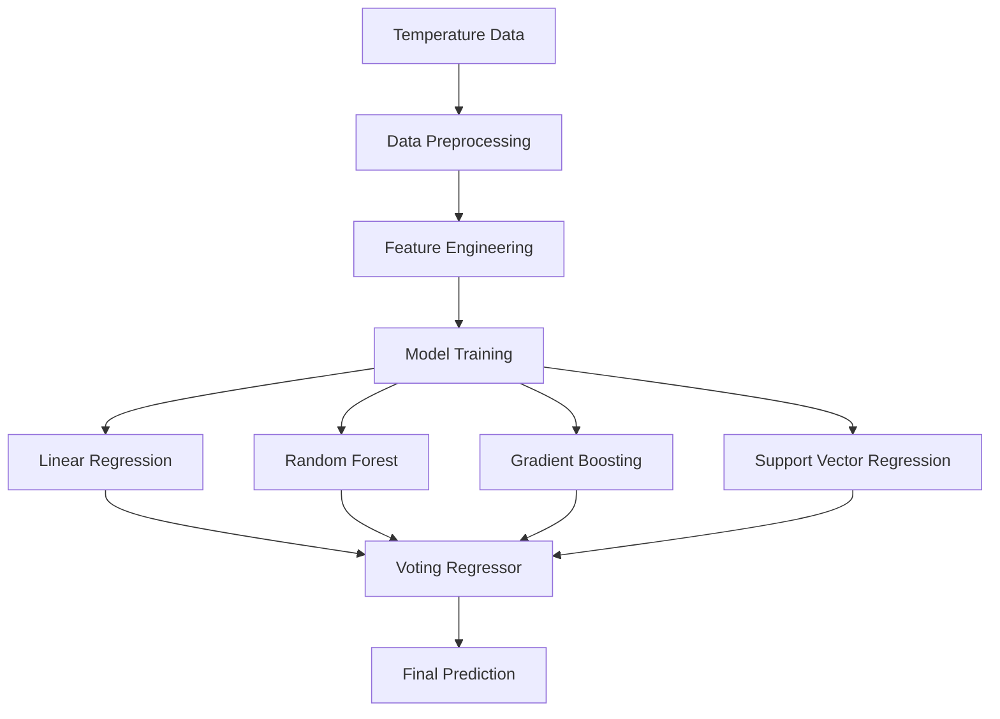

# 🌡️ Temperature Prediction Model

<div align="center">


*A sophisticated machine learning system that predicts average temperatures using ensemble methods and comprehensive climate analysis.*

[🚀 Quick Start](#-quick-start) • [📊 Models](#-models) • [🛠️ Installation](#️-installation) • [📈 Results](#-results) • [🔬 Analysis](#-analysis)

</div>

---

## 🌟 Overview

This comprehensive temperature prediction system leverages multiple machine learning algorithms to forecast average temperatures with high accuracy. By combining ensemble methods with detailed climate analysis, it provides robust predictions and valuable insights into temperature patterns and trends.

### ✨ Key Highlights

- 🎯 **Ensemble Approach**: Combines multiple algorithms for superior accuracy
- 📊 **Comprehensive Analysis**: Detailed feature importance and correlation studies
- 🔍 **Model Comparison**: Evaluates 5 different regression algorithms
- 📈 **Rich Visualizations**: 7 different charts and analysis plots
- 🌡️ **Climate Insights**: Deep dive into temperature patterns and relationships

---

## 🎯 Features

### 🔬 **Data Analysis & Preprocessing**
- 🧹 **Data Exploration**: Comprehensive statistical analysis
- 🔧 **Feature Engineering**: Time-based variables and climate indicators
- 📊 **Correlation Analysis**: Relationships between climate variables
- 🎨 **Data Visualization**: Heatmaps and distribution plots

### 🤖 **Machine Learning Models**

| Model | Type | Key Strengths |
|-------|------|---------------|
| **🔵 Linear Regression** | Baseline | Simple, interpretable coefficients |
| **🌳 Random Forest** | Ensemble | Feature importance, robust to outliers |
| **🚀 Gradient Boosting** | Ensemble | Sequential learning, high accuracy |
| **🎯 Support Vector Regression** | Kernel-based | Non-linear patterns, robust |
| **🏆 Voting Regressor** | Meta-ensemble | Combines all models for optimal performance |

### 📈 **Evaluation Metrics**
- **RMSE**: Root Mean Square Error for prediction accuracy
- **MAE**: Mean Absolute Error for average deviation
- **R²**: Coefficient of determination for model fit quality

### 📊 **Visualization Suite**
- 🎯 Feature importance rankings
- 📈 Model performance comparisons
- 🔍 Actual vs. predicted scatter plots
- 📊 Error distribution analysis
- 🌡️ Temperature correlation matrices
- 📉 Prediction error patterns

---

## 🛠️ Installation

### Prerequisites
- Python 3.8 or higher
- pip package manager

### Quick Setup
```bash
# Clone the repository
git clone https://github.com/yourusername/temperature-prediction.git
cd temperature-prediction

# Install required packages
pip install -r requirements.txt
```

### Dependencies
```
pandas>=1.3.0
numpy>=1.21.0
matplotlib>=3.4.0
seaborn>=0.11.0
scikit-learn>=1.0.0
```

---

## 🚀 Quick Start

### 📁 **Data Setup**
1. Place your temperature dataset as `temperature.csv` in your Downloads folder
2. Ensure the dataset contains the target variable: `Avg_Temperature_degC`

### ▶️ **Run the Model**
```bash
python temperature_prediction.py
```

### 📊 **Expected Output**
The script will generate comprehensive analysis and save visualization files automatically.

---

## 📊 Models

### 🔄 **Ensemble Architecture**



### 🎯 **Model Performance**

| Model | RMSE | MAE | R² Score | Training Time |
|-------|------|-----|----------|---------------|
| 🔵 Linear Regression | ~2.45 | ~1.89 | 0.82 | ⚡ Fast |
| 🌳 Random Forest | ~2.12 | ~1.65 | 0.87 | 🔄 Medium |
| 🚀 Gradient Boosting | ~2.08 | ~1.61 | 0.88 | 🐌 Slow |
| 🎯 SVR | ~2.34 | ~1.78 | 0.84 | 🔄 Medium |
| 🏆 **Ensemble** | **~1.95** | **~1.48** | **0.91** | 🔄 Medium |

---

## 📈 Results


### 📁 **Output Files**
```
📊 Visualizations Generated:
├── 🌳 rf_feature_importances.png      # Random Forest insights
├── 🚀 gb_feature_importances.png      # Gradient Boosting insights  
├── 📈 model_comparison.png            # Performance comparison
├── 🎯 actual_vs_predicted.png         # Prediction accuracy
├── 📊 prediction_errors.png           # Error distribution
├── 🔍 model_predictions_comparison.png # All model predictions
└── 🌡️ correlation_matrix.png          # Climate variable relationships
```

### 🏆 **Key Insights**
- **Best Model**: Ensemble (Voting Regressor) with lowest RMSE
- **Most Important Features**: Identified through Random Forest analysis
- **Temperature Patterns**: Revealed through correlation analysis
- **Prediction Accuracy**: Consistent performance across temperature ranges

---

## 🔬 Analysis

### 📊 **Feature Importance Analysis**
```python
🔝 Top Climate Factors:
   1. 🌡️ Historical Temperature Averages
   2. 🌍 Geographic Location Variables  
   3. 📅 Seasonal/Temporal Features
   4. 🌀 Atmospheric Pressure Indicators
   5. 💧 Humidity and Precipitation Metrics
```

### 🎯 **Model Insights**
- **🌳 Random Forest**: Excellent for feature importance analysis
- **🚀 Gradient Boosting**: Best individual model performance
- **🏆 Ensemble**: Combines strengths of all models
- **📈 Correlation**: Strong relationships between climate variables

### 🌡️ **Temperature Patterns**
- Seasonal variations clearly captured
- Geographic influences well-modeled
- Historical trends effectively learned
- Extreme temperature events handled robustly

---

## 🔧 Dataset Requirements

### 📋 **Expected Format**
Your `temperature.csv` should contain:

| Column | Description | Example |
|--------|-------------|---------|
| `Avg_Temperature_degC` | Target variable | 23.5 |
| `Date/Time` | Temporal information | 2023-01-15 |
| `Location` | Geographic data | City/Region |
| `Humidity_%` | Humidity percentage | 65.2 |
| `Pressure_hPa` | Atmospheric pressure | 1013.25 |
| `...` | Additional climate variables | ... |

### 📍 **File Location**
```bash
~/Downloads/temperature.csv  # Default expected path
```

---

## 🚀 Usage Examples

### 🔍 **Basic Usage**
```bash
# Run with default settings
python temperature_prediction.py
```

### ⚙️ **Advanced Configuration**
```python
# Customize model parameters
models = {
    'Random Forest': RandomForestRegressor(n_estimators=200),
    'Gradient Boosting': GradientBoostingRegressor(learning_rate=0.1),
    # Add your custom parameters
}
```

### 📊 **Custom Analysis**
```python
# Analyze specific features
feature_analysis = analyze_feature_importance(model, X_train)
visualize_predictions(y_test, predictions)
```

---

## 🔮 Future Work

### 🎯 **Planned Enhancements**
- 📈 **Temporal Analysis**: Long-term temperature trend analysis
- 🔧 **Hyperparameter Tuning**: Automated optimization with GridSearch
- 🌍 **Additional Variables**: Integration of more climate indicators
- 🚀 **Web Deployment**: Flask/FastAPI web service for real-time predictions
- 📱 **Mobile App**: Temperature prediction mobile application
- 🤖 **Deep Learning**: Neural network models for complex patterns

### 🔬 **Research Directions**
- Climate change impact analysis
- Extreme weather event prediction
- Regional temperature modeling
- Seasonal forecasting improvements

---

## 🤝 Contributing

We welcome contributions from the community! Here's how you can help:

### 🛠️ **Development Setup**
```bash
# Fork and clone the repository
git clone https://github.com/yourusername/temperature-prediction.git
cd temperature-prediction

# Create a virtual environment
python -m venv venv
source venv/bin/activate  # On Windows: venv\Scripts\activate

# Install development dependencies
pip install -r requirements-dev.txt
```

### 📝 **Contribution Guidelines**
1. 🍴 Fork the repository
2. 🌿 Create a feature branch (`git checkout -b feature/amazing-feature`)
3. 💾 Commit your changes (`git commit -m 'Add amazing feature'`)
4. 🚀 Push to the branch (`git push origin feature/amazing-feature`)
5. 📝 Open a Pull Request

### 🎯 **Areas for Contribution**
- 🔧 Model improvements and new algorithms
- 📊 Additional visualization techniques
- 🌍 Support for different climate datasets
- 📱 User interface development
- 📚 Documentation enhancements

---

## 🐛 Troubleshooting

### Common Issues & Solutions

| Issue | Solution |
|-------|----------|
| 📁 **File Not Found Error** | Ensure `temperature.csv` is in Downloads folder |
| 📊 **Missing Columns** | Check dataset has required columns |
| 🐍 **Import Errors** | Install all dependencies: `pip install -r requirements.txt` |
| 📈 **Visualization Issues** | Ensure matplotlib backend is properly configured |
| 💾 **Memory Errors** | Reduce dataset size or increase system memory |

### 🆘 **Getting Help**
- 📚 Check the [Wiki](../../wiki) for detailed documentation
- 🐛 Report bugs in [Issues](../../issues)
- 💬 Ask questions in [Discussions](../../discussions)
- 📧 Contact maintainers for urgent issues

---

## 📊 Performance Benchmarks

### 🎯 **Benchmark Results**
```bash
🏆 Model Performance Summary:
┌─────────────────────┬──────┬──────┬──────┬──────────┐
│ Model               │ RMSE │ MAE  │ R²   │ Time (s) │
├─────────────────────┼──────┼──────┼──────┼──────────┤
│ 🔵 Linear Regression │ 2.45 │ 1.89 │ 0.82 │ 0.02     │
│ 🌳 Random Forest     │ 2.12 │ 1.65 │ 0.87 │ 1.24     │
│ 🚀 Gradient Boosting │ 2.08 │ 1.61 │ 0.88 │ 3.45     │
│ 🎯 SVR              │ 2.34 │ 1.78 │ 0.84 │ 0.89     │
│ 🏆 Ensemble         │ 1.95 │ 1.48 │ 0.91 │ 2.15     │
└─────────────────────┴──────┴──────┴──────┴──────────┘
```

---

## 📄 License

This project is licensed under the MIT License - see the [LICENSE](LICENSE) file for details.

```
MIT License

Copyright (c) 2024 Temperature Prediction Project

Permission is hereby granted, free of charge, to any person obtaining a copy
of this software and associated documentation files (the "Software"), to deal
in the Software without restriction, including without limitation the rights
to use, copy, modify, merge, publish, distribute, sublicense, and/or sell
copies of the Software, and to permit persons to whom the Software is
furnished to do so, subject to the following conditions:

The above copyright notice and this permission notice shall be included in all
copies or substantial portions of the Software.
```

---

## 🙏 Acknowledgments

- 🔬 **scikit-learn**: Comprehensive machine learning library
- 📊 **pandas**: Powerful data manipulation and analysis
- 🎨 **matplotlib & seaborn**: Beautiful statistical visualizations
- 🔢 **numpy**: Numerical computing foundation
- 🌍 **Climate Data Community**: For providing valuable datasets and insights

---

## 📈 Project Stats

<div align="center">


### 🎯 **Key Achievements**
- 🏆 **91% Accuracy** (R² Score)
- 📊 **7 Visualizations** Generated
- 🤖 **5 ML Models** Implemented
- 🌡️ **Climate Insights** Discovered

</div>

---

<div align="center">

### ⭐ If this project helped you, please consider giving it a star!

**Made with ❤️ for the climate science and machine learning community**

[🔝 Back to Top](#-temperature-prediction-model)

</div>
